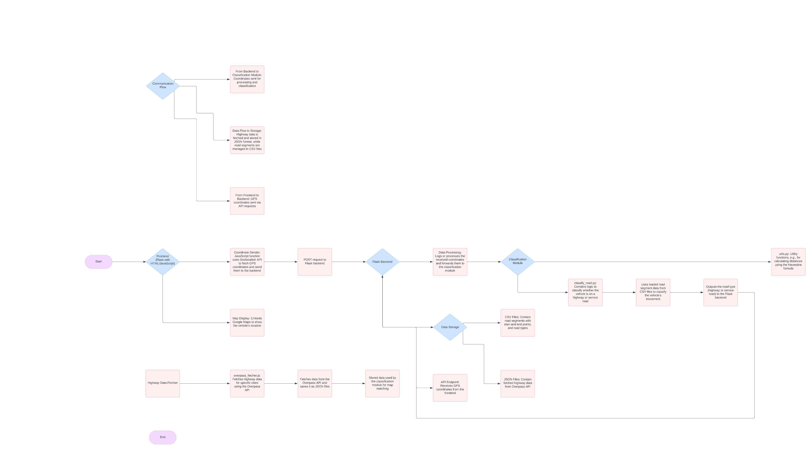
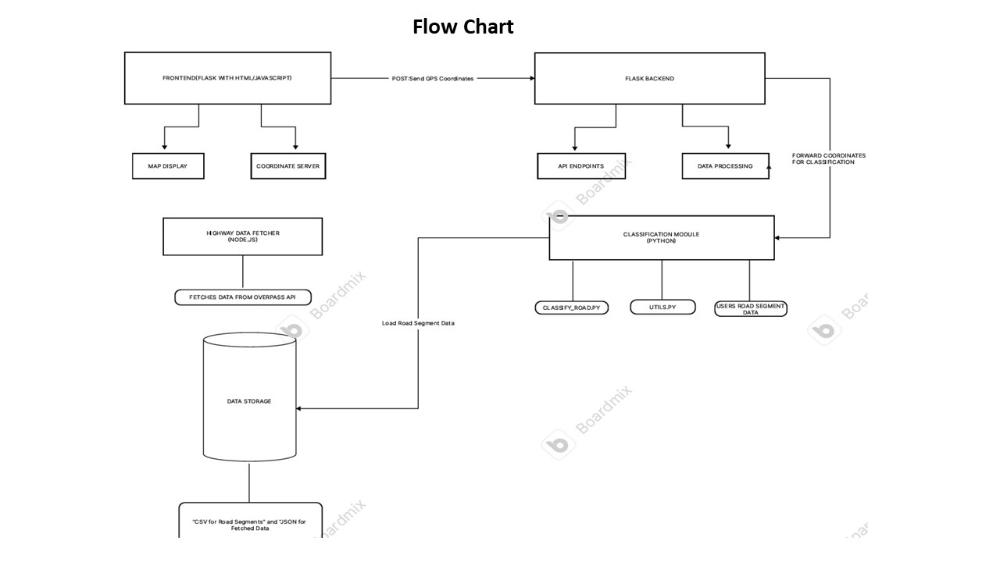

# 🚗 Map-Matching Algorithm for Highway and Service Road Classification

This project was developed by **Pallerla Sohan**, an Information Technology student at Vasavi College of Engineering, Hyderabad. It implements a real-time map-matching algorithm that classifies whether a vehicle is on a **highway** or **service road** using geometric computations on GNSS coordinates. The system is built using a full-stack approach and is designed to be integrated with AI/ML techniques in the future.

---

## 📌 Project Overview

This application addresses the challenges in real-time road classification due to **GNSS inaccuracies**, **signal dropout**, and **coordinate bias**. It is suitable for smart mobility applications such as:

- GNSS-based tolling
- Navigation systems
- Fleet tracking
- Smart transportation analytics

The solution uses **Flask (Python)** for the backend, a simple **HTML/JavaScript frontend** with Google Maps integration, and CSV-based road segment data.

---

## ✨ Features

- 🔄 Real-time vehicle tracking using browser geolocation  
- 🛣️ Accurate road classification: Highway or Service Road  
- 🗺️ Live map view using Google Maps API  
- 📡 GPS coordinate capture and display  
- 📊 CSV-based road segment loading  
- ⚙️ Modular design with clean, readable Python functions  
- 🤖 AI/ML-ready for future accuracy improvements

---

## 📁 Project Structure

```
MAP MATCHING ALGORITHM/
├── __pycache__/                    # Compiled Python files
├── .qodo/                          # VS Code plugin data
├── instance/
│   └── todo.db                     # Local DB (if extended for logging)
├── templates/
│   └── map.html                    # HTML frontend with Google Maps
├── app.py                          # Flask backend server
├── classify_road.py                # Core logic for classification
├── FlowChart.jpg                   # Project flow chart
├── SystemArchitecture.jpeg         # System architecture image
├── road_segments.csv               # Sample road segment data
└── README.md                       # Project documentation
```

---

## 🔧 Technology Stack

- **Languages**: Python, HTML, JavaScript  
- **Frameworks**: Flask  
- **Frontend APIs**: Google Maps API, Geolocation API  
- **Tools**: VS Code, GitHub, Jupyter Notebook  

---

## 📋 Prerequisites

- Python 3.x  
- Flask (`pip install flask`)  
- Basic knowledge of HTML, JavaScript, Python

---

## 🛠 Installation

```bash
# Clone the repository
git clone https://github.com/sohanpallerla/map-matching-algorithm.git
cd map-matching-algorithm

# Install Flask
pip install flask

# Run the server
python app.py
```

Open your browser and navigate to:  
[http://localhost:8000](http://localhost:8000)

---

## 📄 How It Works

### 🧭 Frontend (`templates/map.html`)

- Uses Geolocation API to get live location
- Sends GPS data to backend using fetch/POST
- Displays location with marker on Google Map

### 🔁 Backend (`app.py`)

- Flask server handles GPS data via `/submit_coordinates`
- Calls `classify_road()` from `classify_road.py`
- Returns classification result: Highway / Service Road / Unknown

### 🧠 Logic (`classify_road.py`)

- Loads all road segments from `road_segments.csv`
- Measures perpendicular distance to each road segment
- Chooses the closest one and returns its type

---

## 📊 Sample Data (`road_segments.csv`)

```csv
type,start_lat,start_lon,end_lat,end_lon
Highway,17.455,78.378,17.465,78.385
Service Road,17.455,78.376,17.463,78.380
```

---

## 📸 Visuals

### System Architecture



### Flow Chart



---

## 🧪 Example Output

```json
{
  "status": "success",
  "road_type": "Service Road"
}
```

---

## 🚀 Future Enhancements

- 🤖 Train and integrate an ML model for noisy or ambiguous GPS input  
- 🌐 Add more road segment coverage (Hyderabad, India)  
- 📍 Add live route tracing on map  
- 💾 Log user coordinates with timestamps into `todo.db`  
- 📊 Admin dashboard for history and analytics

---

## 👨‍💻 Author

**Pallerla Sohan**  
📧 Email: [sohanpallerla@gmail.com](mailto:sohanpallerla@gmail.com)  

---

## 📜 License

This project is licensed under the **MIT License**.
